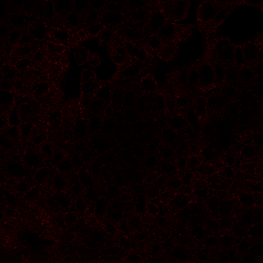
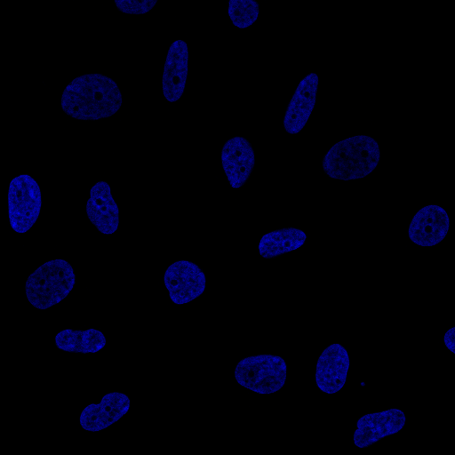

#### Introduction
- Problem: Image classification which has multiple labels to single input data  
- There are 28 proteins in labels  
- Multiple proteins can be shown in one image  
- 28 proteins have different shapes
- Multiple labels means one image can have multiple labels like [one_image,[protein_label1,protein_label2,protein_label3]]  
- And dataset is quite imbalance which means, for example, protein_label1 shows up very frequently, protein_label2 shows very rarely  
- You should manage that imbalance in the process of training

#### Libraries
- Python 3.6
- PyTorch 1.0.1.post2
- CUDA V10.0.130
- CuDNN v7.4
- And others which you can install whenever you run into unmet-dependencies

#### Used techniques
- `Python shell scripting` to split excessively large dataset into separated multiple directories  
Then, you will easily access each directory to see the image files  
https://github.com/youngminpark2559/kaggle/blob/master/histopathologic-cancer-detection/src/utils/utils_split_files_into_directories_to_easily_upload_files_onto_colab.py

- `Grad CAM` to see where neural network pays attention to by analyzing gradient values.  
https://github.com/youngminpark2559/kaggle/blob/master/histopathologic-cancer-detection/src/utils_analyzing_result/grad_cam.py

You can check my summaries and comments if you want to briefly see it  
https://youngminpark2559.github.io/ml_cv_p/Grad-CAM_Visual_Explanations_from_Deep_Networks_via_Gradient-based_Localization/summaries_and_notes.html

- `CBAM attention modules` which help the neural network to see better place (where) and better things (what) for target class  
https://github.com/youngminpark2559/kaggle/blob/master/histopathologic-cancer-detection/src/networks/networks.py#L864  
https://github.com/youngminpark2559/kaggle/blob/master/histopathologic-cancer-detection/src/networks/cbam.py

You can check my summaries and comments if you want to briefly see it  
https://youngminpark2559.github.io/ml_cv_p/CBAM_Convolutional_Block_Attention_Module/paper_summary.html

- `K-Fold Cross-Validation`  

- `Focal Loss`  

- `Metrics` to inspect dataset before training and to evaluate performance of the deep learning model after training by using Accuracy, Precision, Recall, ROC Curve, F1 Score, etc  
https://github.com/youngminpark2559/kaggle/blob/master/histopathologic-cancer-detection/src/train/train_by_transfer_learning_using_resnet.py#L374

If you want to briefly see the concept of metric, you can check this out  
1. For metrics for regression (L1 norm, L2 norm, etc), For metrics for classification (accuracy, precision, recall)  
https://youngminpark2559.github.io/mltheory/terry/YouTube/001_005_Metrics_for_deep_learrning_classification_Accuracy_Precision_Recall.html
2. Supplementary for accuracy, precision, recall. And for ROC curve, AUC  
https://youngminpark2559.github.io/mltheory/terry/YouTube/001_006_ROC_curve_AUC_Precision_Recall.html

#### Visualize RGBY images  
RGB, R channel, G channel, B channel, Y channel but shown as R channel  
    

    

    

#### Analyze label data
- Frequent distribution of train label data  
  
Meaning: label data is very imbalance; Nucleoplasm very often shows, Rods & rings shows very rarely.  

- Frequent distribution of number of labels to each image
  
Meaning: Many image has 1 label  


Following is written for previous project.  
They will be updated.  
#### Train information
- Epoch: 6 epochs (one epoch took 2 hours on GTX 1060 6GB GPU)
- Batch size: 30  
- Weight on loss value: 10.0 (i.e., final_loss_value=10.0*loss_value)
- Train dataset split: train 90%, validation 10%
- Input image size: resized (224,224,3) from original original (96,96,3)
- Tested network
1. ResNet50+CBAM attention module which is originated from https://github.com/Jongchan/attention-module


#### Work flow on this project that I went through
1. Run a following util file to process big data  
https://github.com/youngminpark2559/kaggle/blob/master/histopathologic-cancer-detection/src/utils/utils_split_files_into_directories_to_easily_upload_files_onto_colab.py

2. Edit argument for epoch, batchsize, mode (like train, validation, submission), continuous training, network type, etc to values whatever you want to use  
https://github.com/youngminpark2559/kaggle/blob/master/histopathologic-cancer-detection/src/argument_api/argument_api_module.py

3. Train  
https://github.com/youngminpark2559/kaggle/blob/master/histopathologic-cancer-detection/src/train/train_by_transfer_learning_using_resnet.py#L90

4. Validation  
https://github.com/youngminpark2559/kaggle/blob/master/histopathologic-cancer-detection/src/train/train_by_transfer_learning_using_resnet.py#L265

5. Test and make a submission  
https://github.com/youngminpark2559/kaggle/blob/master/histopathologic-cancer-detection/src/train/train_by_transfer_learning_using_resnet.py#L420

#### Result
- Validation scores using 10% number of images from full train dataset  
```
Accuracy score: 0.95  
precision score: 0.96  
recall score: 0.91  
F1 score: 0.93  
```

- ROC curve on results  
  

- Kaggle scores using full 50000 test images  
  

- Grad CAM output  
  
  
  
  

#### Opinion on trainng process and result
- At first I used center cropped (48,48,3) from original image (96,96,3)  
But I decided to original image into (224,224,3) with thinking that large image can be more good source of feature map in deep CNN network.

#### Backpropagation, autograd, gradient in PyTorch
- If you want to read above topics which are relevant to Grad CAM which deals with gradient values, check this out  
https://youngminpark2559.github.io/prac_ml/pytorch/kykim/002_autograd_and_Variable.html
