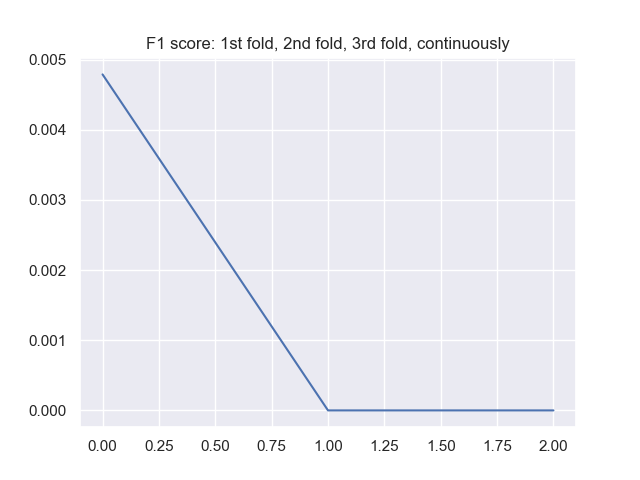

#### Introduction
- Problem: Image classification which has multiple labels to single input data  
- There are 28 proteins in labels  
- Multiple proteins can be shown in one image  
- 28 proteins have different shapes
- Multiple labels means one image can have multiple labels like [one_image,[protein_label1,protein_label2,protein_label3]]  
- And dataset is quite imbalance which means, for example, protein_label1 shows up very frequently, protein_label2 shows very rarely  
- You should manage that imbalance in the process of training

#### Libraries
- Python 3.6
- PyTorch 1.0.1.post2
- CUDA V10.0.130
- CuDNN v7.4
- And others which you can install whenever you run into unmet-dependencies

#### Used techniques
- `Python shell scripting` to split excessively large dataset into separated multiple directories  
Then, you will easily access each directory to see the image files  
https://github.com/youngminpark2559/kaggle/blob/master/histopathologic-cancer-detection/src/utils/utils_split_files_into_directories_to_easily_upload_files_onto_colab.py

- `Grad CAM` to see where neural network pays attention to by analyzing gradient values.  
https://github.com/youngminpark2559/kaggle/blob/master/histopathologic-cancer-detection/src/utils_analyzing_result/grad_cam.py

You can check my summaries and comments if you want to briefly see it  
https://youngminpark2559.github.io/ml_cv_p/Grad-CAM_Visual_Explanations_from_Deep_Networks_via_Gradient-based_Localization/summaries_and_notes.html

- `CBAM attention modules` which help the neural network to see better place (where) and better things (what) for target class  
https://github.com/youngminpark2559/kaggle/blob/master/histopathologic-cancer-detection/src/networks/networks.py#L864  
https://github.com/youngminpark2559/kaggle/blob/master/histopathologic-cancer-detection/src/networks/cbam.py

You can check my summaries and comments if you want to briefly see it  
https://youngminpark2559.github.io/ml_cv_p/CBAM_Convolutional_Block_Attention_Module/paper_summary.html

- `K-Fold Cross Train and Validation`  
(1) Code  
/mnt/1T-5e7/mycodehtml/bio_health/Kaggle/human-protein-atlas-image-classification/My_code/V1/prj_root/src/utils_for_dataset/custom_ds.py

- `Focal Loss`  
(1) Code  
def FocalLoss(output,target):
/mnt/1T-5e7/mycodehtml/bio_health/Kaggle/human-protein-atlas-image-classification/My_code/V1/prj_root/src/loss_functions/loss_functions_module.py

- `Metrics` to inspect dataset before training and to evaluate performance of the deep learning model after training by using Accuracy, Precision, Recall, ROC Curve, F1 Score, etc  
https://github.com/youngminpark2559/kaggle/blob/master/histopathologic-cancer-detection/src/train/train_by_transfer_learning_using_resnet.py#L374

If you want to briefly see the concept of metric, you can check this out  
1. For metrics for regression (L1 norm, L2 norm, etc), For metrics for classification (accuracy, precision, recall)  
https://youngminpark2559.github.io/mltheory/terry/YouTube/001_005_Metrics_for_deep_learrning_classification_Accuracy_Precision_Recall.html
2. Supplementary for accuracy, precision, recall. And for ROC curve, AUC  
https://youngminpark2559.github.io/mltheory/terry/YouTube/001_006_ROC_curve_AUC_Precision_Recall.html

#### Visualize RGBY images  
-- RGB, R channel, G channel, B channel, Y channel but shown as R channel  
    

    

    

-- Code: /src/utils_preanalyze_data/utils_preanalyze_data_module.py
visualize_images(args)

#### Analyze label data
(1) Frequent distribution of train label data  
  
-- Meaning: label data is very imbalance; Nucleoplasm very often shows, Rods & rings shows very rarely.  
-- Code: /src/utils_preanalyze_data/utils_preanalyze_data_module.py

(2) Frequent distribution of number of labels to each image
  
-- Meaning: Many images have 1 label  
-- Code: /src/utils_preanalyze_data/utils_preanalyze_data_module.py  

(3) Correlation of proteins  
  
-- Meaning: No much of correlation of couple of proteins  
Some proteins has positive correlation (blue) (if one proteins shows more, corresponding other proten also shows more)  
Some proteins has negative correlation (red) (if one proteins shows more, corresponding other proten also shows less)  
-- Code: /src/utils_preanalyze_data/utils_preanalyze_data_module.py  

#### Train result  
(1) Decrease of loss value  
- Visualization  
  
- Code:  

(2) F1 scores  
- Visualization  
  
- Code  

#### Backpropagation, autograd, gradient in PyTorch
- If you want to read above topics which are relevant to Grad CAM which deals with gradient values, check this out  
https://youngminpark2559.github.io/prac_ml/pytorch/kykim/002_autograd_and_Variable.html
